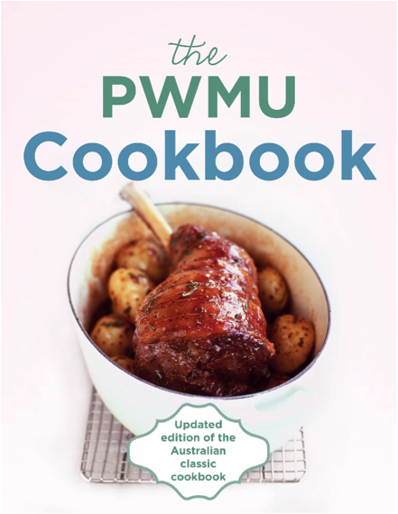
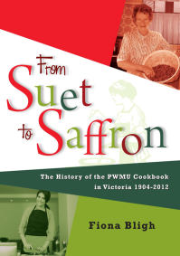

# The Famous PWMU Cookbook
# over 100 years of hearty sustenance
##

-------------------------------------|-------------------------------------------------------
|

Please view or [download full postage details here (pdf 373Kb)](PWMU_Cookbooks_2015_Details.pdf) and this [order form (pdf 283Kb)](Cookbooks_Order_20151026.pdf).

An Australian Classic, revised and fully updated for the 21st Century.

The PWMU COOKBOOK has a unique place in Australian kitchens. First published in 1904 and revised and reprinted many times since, it has sold well over 500,000 copies. This fifth edition contains recipes ranging from tried-and-true classics to more contemporary dishes with an international flavour, reflecting our multicultural population. Need a never-fail recipe for scones or sponge cake? A foolproof method for making hollandaise sauce or cooking a roast? Want to try your hand at Mongolian lamb or mee goreng? They are all in the PWMU COOKBOOK, along with the general guidance and handy hints that make it both a reliable companion and an essential tool for all cooks, whether beginners or experienced.

The PWMU Cookbook Committee is a joint committee of the Presbyterian and Uniting Churches, and is based in Melbourne.

Sales of this book have aided the work of PWMU since 1904 and the work of the Uniting Church Adult Fellowship since 1977 - and continue to do so.

The income PWMU receives from sales is specifically used to fund students from developing countries who come to the Presbyterian Theological College in Box Hill, Melbourne. They are given training which is aimed to benefit their home churches.

To date students from these countries have been trained: Nigeria, Vanuatu, Korea, the Philippines, Malawi and India.

Presbyterian parents have long made sure their children have their Bible and their PWMU Cookbook in their bags when they leave home.

## Commemorative Edition

Out of the ashes of the February 2009 fires the PWMU Cookbook Committee was asked by Helen Kenney of the St Andrews CFA could she photocopy recipes to hand out to families whose houses were burnt down. It had come to her attention that many cooks were so traumatised that they could not remember simple recipes that they had used for years. Both the Presbyterian and Uniting Churches donated funds to purchase 65 cookbooks from the publisher at a reduced rate. On 5 June these 65 books were presented to St Andrews. The PWMU Cookbook Committee then looked into the possibility of donating a book to approximately 2000 more families throughout Victoria who had lost their homes on Black Saturday.

Each book will have an inside label attached stating that it comes with the good wishes from both churches and Hachette publishers.

There will still be over 4500 copies of the Cookbook in stock so plenty will be available for others wishing to purchase them. The publisher will give a 35% discount for church groups when orders and payment are made together.

 
## Sample recipe from p 35

(used with permission)

Here's something to warm you up on a cold winter's day!

Corn and Bacon Chowder (serves 4)

- 3 rashers bacon
- 2 1/2 cups (625 ml) milk
- 1 small onion, finely sliced
- 1/2 cup (50g) diced celery
- 1 potato, peeled and diced
- 1 x 420g can sweet corn kernels
		
- 1 cup (250 ml) hot water
- pinch of cayenne pepper
- 1 tablespoon butter
- salt to taste
- 1 tablespoon flour
- 1 tablespoon chopped parsley

1. Chop bacon and saute in a large, heavy-based pan. Remove from pan. 
2. Add onion and cook until soft, not brown. Add diced potato and hot water and simmer for 10 minutes.
3. In another pan make white sauce from butter, flour and milk (see p. 48). 
4. Add white sauce, celery and sweet corn to potato mixture and simmer for 15 minutes - as this is a very thick soup it should be stirred frequently to prevent sticking.
5. Add cayenne and salt to taste.
6. To serve, sprinkle bacon and parsley on top.

